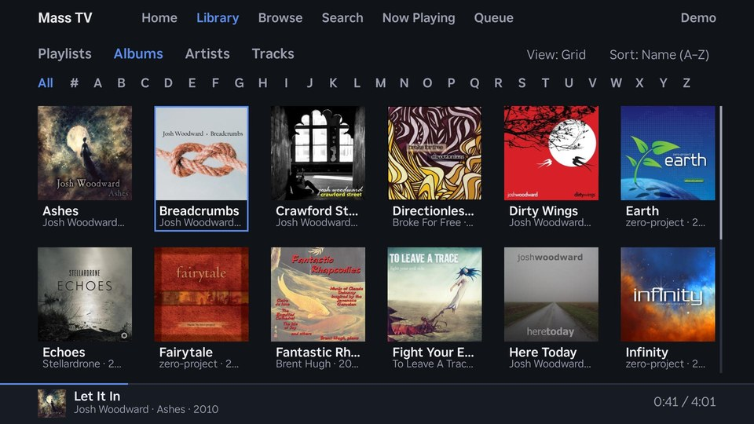
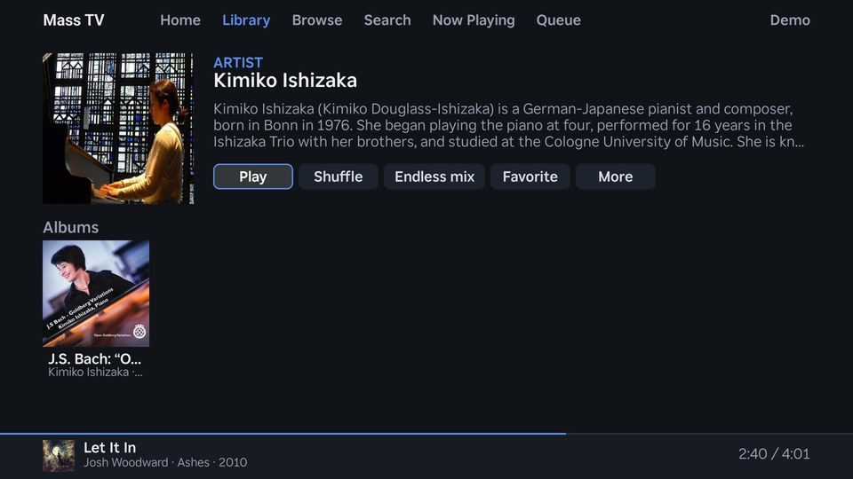
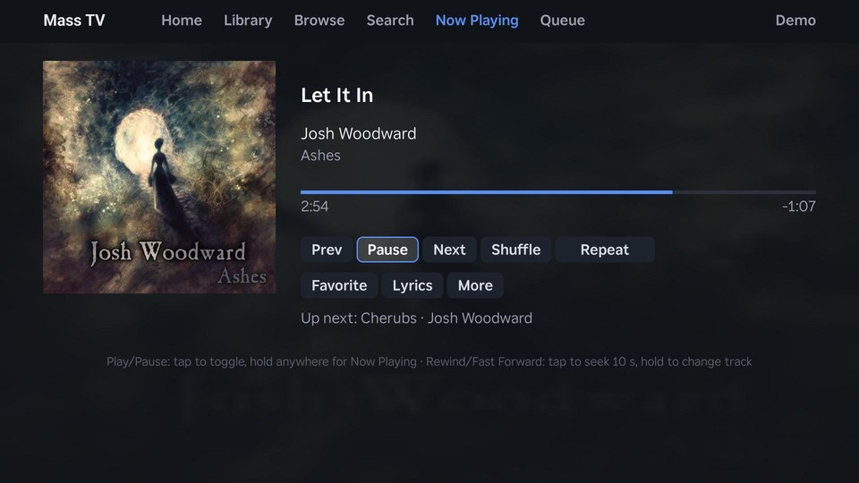
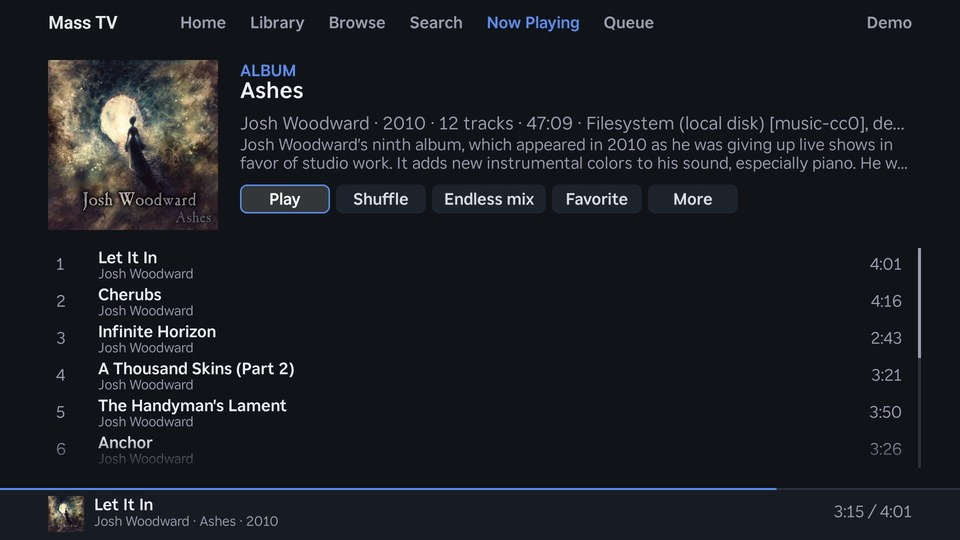
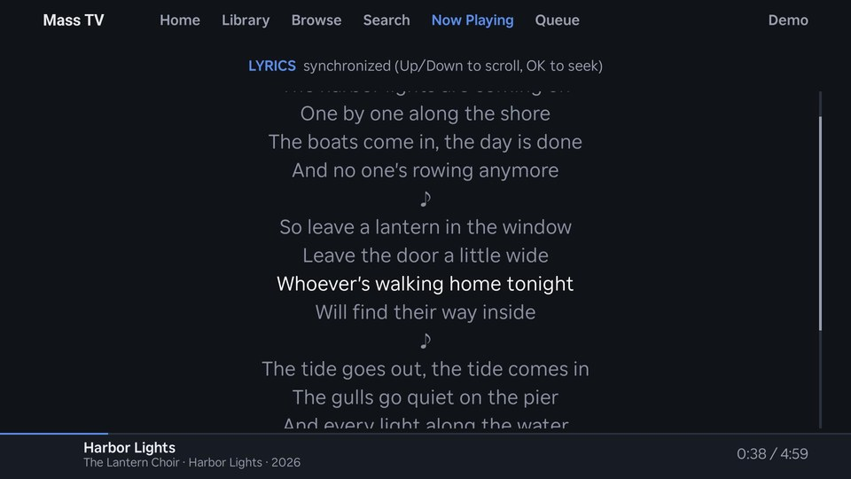
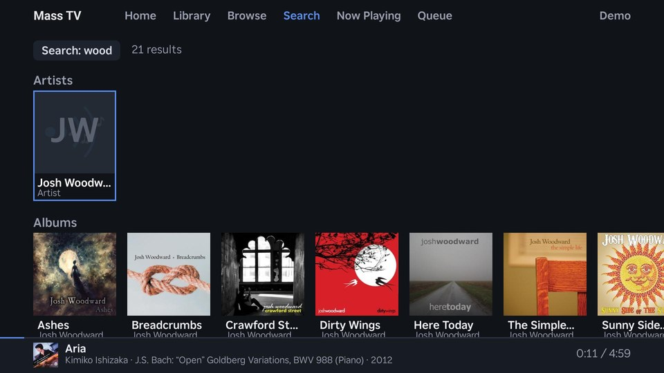

# Mass TV

A Roku app for [Music Assistant](https://www.music-assistant.io/): browse
and play your music on the TV with the remote, and let Music Assistant
play to the TV.

Mass TV is both a client and a player. As a client it talks to your own
Music Assistant server: Home (recently played and recommendations),
Library (playlists, albums, artists, and tracks, as grids or lists, with
sorting), Browse (your music sources), Search, Now Playing, and the
queue. As a player it takes the streams Music Assistant sends to the TV,
so anything that controls Music Assistant (its web UI, phone app, or Home
Assistant) can play there.

- One profile per Music Assistant user, each on its own server, with a
  "Who's listening?" picker when there are several.
- Link a profile with the remote (server address, username, and
  password), or scan a QR code to finish on your phone; servers on your
  network are found automatically (mDNS).
- Roku's screen reader (Audio Guide) reads every screen.
- A bundled font for Chinese, Japanese, Korean, and emoji in titles and
  names, which Roku's own font can't show.

<table>
<tr>
<td></td>
<td></td>
</tr>
<tr>
<td align="center">Library: albums, with letters to jump to</td>
<td align="center">An artist's page while music plays</td>
</tr>
<tr>
<td></td>
<td></td>
</tr>
<tr>
<td align="center">Now Playing</td>
<td align="center">An album's page</td>
</tr>
<tr>
<td></td>
<td></td>
</tr>
<tr>
<td align="center">Synchronized lyrics</td>
<td align="center">Search</td>
</tr>
</table>

Mass TV is an independent project. It is not made by, affiliated with,
or endorsed by Music Assistant, the Open Home Foundation, or Roku.

## Requirements

- Music Assistant 2.10 or newer.
- A Roku running Roku OS 15.1 or newer.
- For playback on the TV, Music Assistant's **Media Assistant (Roku)**
  player provider, with its Roku app ID set to Mass TV's: `883989` for
  the Roku Channel Store app, or `dev` for a sideloaded build. Mass TV
  plays the same deep links as the Media Assistant Roku app, so the
  provider needs nothing else. Settings > This TV's player shows the app
  ID to use.

## Building

You need Node.js 22, Python 3 (with `venv`), and GNU Make 4.3 or newer.

    npm ci
    make build        # debug build into build/debug
    make release      # release build into build/release
    make zip          # sideload package out/masstv-debug.zip
    make zip-release  # sideload package out/masstv-release.zip
    make check        # lint, unit tests, and the end-to-end test

`make check` runs everything off-device: the unit tests and the whole app
run in the `brs-cli` simulator (brs-node), the end-to-end test against
`tools/fake_ma.py`, a fake Music Assistant server. No Roku or Music
Assistant is needed.

The UI's rules are in [docs/ui-idioms.md](docs/ui-idioms.md) (how
things look and respond to the remote) and
[docs/ui-flows.md](docs/ui-flows.md) (the screens, how they're reached,
and what each key does there).

## Running on a Roku

Mass TV is available on the Roku Channel Store: search for "Mass TV" on
the Roku,
[add it to your Roku account](https://my.roku.com/account/add?channel=MASSTV),
or add it from its
[store page](https://channelstore.roku.com/details/fc0588fb13ad2e8bd94263853acd1d60:a86872c07facb1fa2cb013fea671aa17/mass-tv).
Then link a
profile to your Music Assistant server, and set the Media Assistant
(Roku) provider's app ID to `883989` (see Requirements).

## Sideloading on a Roku

Put the Roku in [developer mode](https://developer.roku.com/docs/developer-program/getting-started/developer-setup.md),
then name it and give its address and developer password in the
environment or in `.env`:

    ROKU_LIVINGROOM_IP=192.0.2.50
    ROKU_DEV_PASSWORD=...

and use `ROKU=<name>` with the device targets:

    ROKU=livingroom make deploy       # sideload the debug build
    ROKU=livingroom make console      # the BrightScript console
    ROKU=livingroom make logs         # the debug build's log
    ROKU=livingroom make screenshot

Debug builds serve their log at `http://<roku>:8889/`. `tools/roku.py`
has more (keys, deep links, packaging); run it without arguments for
help.

## Trying Mass TV without Music Assistant

`tools/fake_ma.py` is a small stand-in for a Music Assistant server (one
Python 3 file, standard library only). With `--demo` it serves an
invented library of three albums, and it plays them on the Roku the way
Music Assistant's Roku player provider does.

1. Install Mass TV on the Roku.
2. On the Roku, allow control from the network: Settings > System >
   Advanced system settings > Control by mobile apps > Network access:
   **Enabled**. Note the Roku's address (Settings > Network > About).
3. On a computer on the same network, run:

       python3 tools/fake_ma.py --roku <Roku's address> --demo

   It prints the address to link to and a user name and password. The
   computer must accept connections on port 8095.
4. In Mass TV, link to that address as `testuser` with that password.

Every track plays as a five-second tone, unless you generate the full
test media first with `make test-media` (it needs ffmpeg). The fake
serves what Mass TV uses of Music Assistant's API, not all of it.

## Images and the bundled font

The app's images (`src/images/`) and its bundled font (`src/fonts/`) are
generated, not kept in git: `tools/make_images.py` draws the icons,
splash screens, and other images (Pillow), and `tools/make_font.py`
builds the font from Noto sources (fontTools). The build and test
targets depend on them, so the first `make` downloads the source fonts
pinned in `fonts/sources.txt` (about 40 MB, into `fonts/source/`,
checksums verified), installs the pinned Pillow and fontTools
(`tools/requirements.txt`) into `.venv`, and generates everything (under
a minute). After that, each is remade only when its script, inputs,
sources, or tool versions change. `make assets` does just this step.
`fonts/README.md` explains the font and how to choose its characters.

## License

Mass TV is licensed under the Apache License 2.0 (`LICENSE`).

The bundled font (`src/fonts/`) is built from Noto Sans, Noto Sans CJK,
Noto Emoji, Noto Sans Arabic, Noto Sans Hebrew, Noto Sans Math, Noto
Sans Symbols, Noto Sans Symbols 2, and Noto Music, and like them is
under the SIL Open Font License 1.1
(`fonts/OFL-*.txt`). The logo's lettering is drawn in Roboto, also under
the SIL Open Font License (`fonts/OFL-Roboto.txt`).

The screenshots (`docs/screenshots/`) show music, album art, and a
photo used under their own licenses, not Mass TV's:

- Kimiko Ishizaka, "The Open Goldberg Variations" (recording
  [CC0 1.0](https://creativecommons.org/publicdomain/zero/1.0/), cover
  [CC BY 4.0](https://creativecommons.org/licenses/by/4.0/)),
  <https://opengoldbergvariations.org/>
- Photo of Kimiko Ishizaka: "Kimiko Douglass-Ishizaka" by Robert
  Douglass,
  [CC BY-SA 3.0](https://creativecommons.org/licenses/by-sa/3.0/), via
  [Wikimedia Commons](https://commons.wikimedia.org/wiki/File:Kimiko_Douglass-Ishizaka.JPG),
  shown cropped
- Josh Woodward, "Ashes", "Breadcrumbs", "Crawford Street", "Dirty
  Wings", "Here Today", "The Simple Life", and "Sunny Side of the
  Street" (music
  [CC BY 4.0](https://creativecommons.org/licenses/by/4.0/); cover art
  by Josh Woodward,
  [CC BY 3.0](https://creativecommons.org/licenses/by/3.0/) or
  [CC BY 3.0 US](https://creativecommons.org/licenses/by/3.0/us/), via
  Wikimedia Commons; the Ashes cover is also shown blurred behind Now
  Playing), <https://www.joshwoodward.com/>
- zero-project, "Earth", "Fairytale", and "Infinity"
  ([CC BY-SA 3.0](https://creativecommons.org/licenses/by-sa/3.0/))
- To Leave A Trace, "Fight Your Evil Side"
  ([CC BY-SA 3.0](https://creativecommons.org/licenses/by-sa/3.0/))
- Brent Hugh, "Fantastic Rhapsodies"
  ([CC BY-SA 2.5](https://creativecommons.org/licenses/by-sa/2.5/))
- Stellardrone, "Echoes"
  ([CC BY 3.0](https://creativecommons.org/licenses/by/3.0/))
- Broke For Free, "Directionless EP"
  ([CC BY 3.0](https://creativecommons.org/licenses/by/3.0/)), Free
  Music Archive

The artist and album descriptions and the lyrics in the screenshots
were written for them.

## Support

Questions, problems, and ideas: open an issue on this repository.
